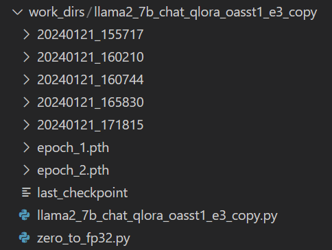
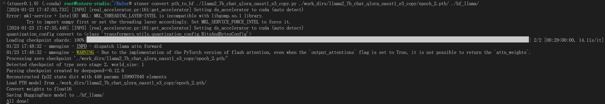
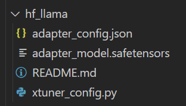
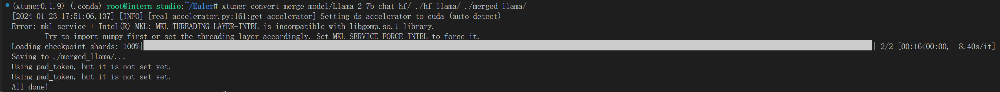
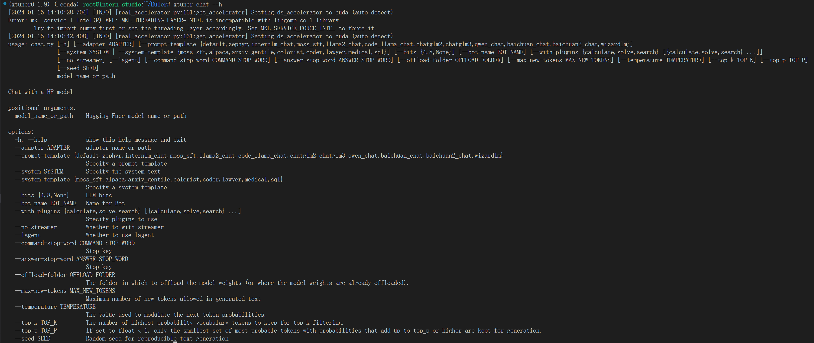
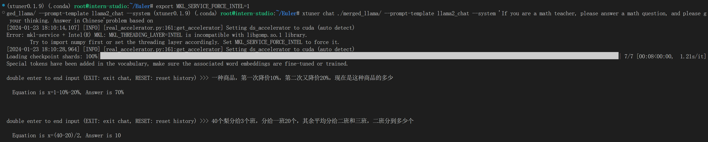
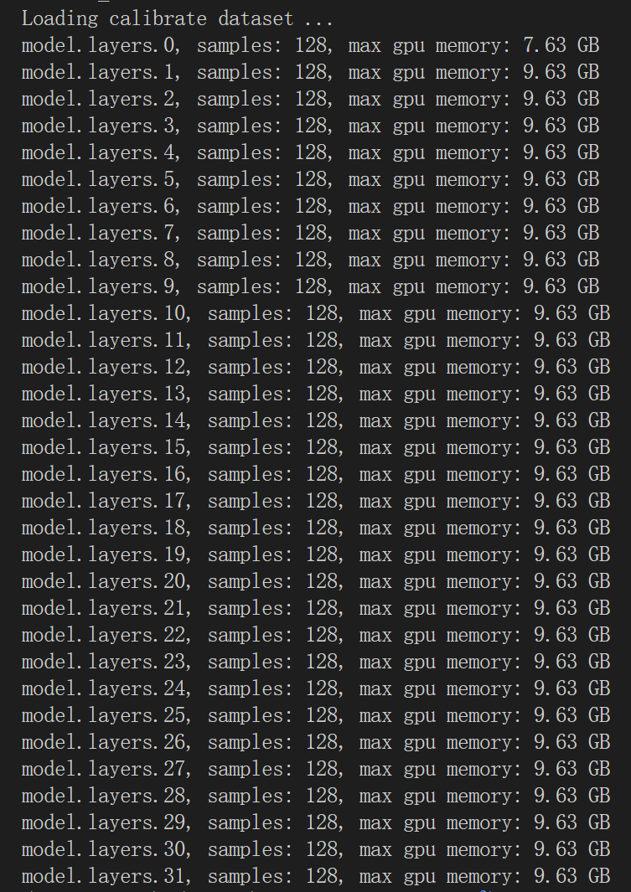
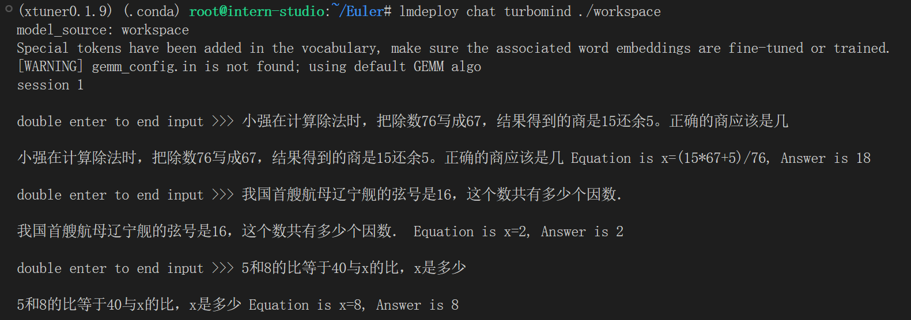

# Euler

### 微调

- 命令行

  ```bash
  xtuner train llama2_7b_chat_qlora_oasst1_e3_copy.py --deepspeed deepspeed_zero2
  ```

- 训练结果

  

- 转换成`hf`格式

  ```bash
  mkdir hf_llama
  export MKL_SERVICE_FORCE_INTEL=1
  xtuner convert pth_to_hf ./llama2_7b_chat_qlora_oasst1_e3_copy.py ./work_dirs/llama2_7b_chat_qlora_oasst1_e3_copy/epoch_2.pth/ ./hf_llama/
  ```

  
  
  
  
  LoRA 模型文件 = Adapter
  
- 整合模型

  ```bash
  xtuner convert merge model/Llama-2-7b-chat-hf/ ./hf_llama/ ./merged_llama/
  ```

  
  
- 使用模型

  

  ```bash
  export MKL_SERVICE_FORCE_INTEL=1
  xtuner chat ./merged_llama/ --prompt-template llama2_chat --system 'If you are a math teacher, please answer a math question, and please give the process and answer to the problem based on your thinking. Answer in Chinese'
  ```

  


### 部署

- 转换模型

  ```bash
  lmdeploy convert llama ./merged_llama/
  ```

- 量化

  ```bash
  lmdeploy lite calibrate \
    --model ./merged_llama/ \
    --calib_dataset "ptb" \
    --calib_samples 128 \
    --calib_seqlen 2048 \
    --work_dir ./quant_output
  ```

  

  ```bash
  lmdeploy lite kv_qparams \
    --work_dir ./quant_output  \
    --turbomind_dir workspace/triton_models/weights/ \
    --kv_sym False \
    --num_tp 1
  ```

  ```bash
  lmdeploy chat turbomind ./workspace
  ```

  