# InternLM-Chat-7B

1. #### 创建开发机

   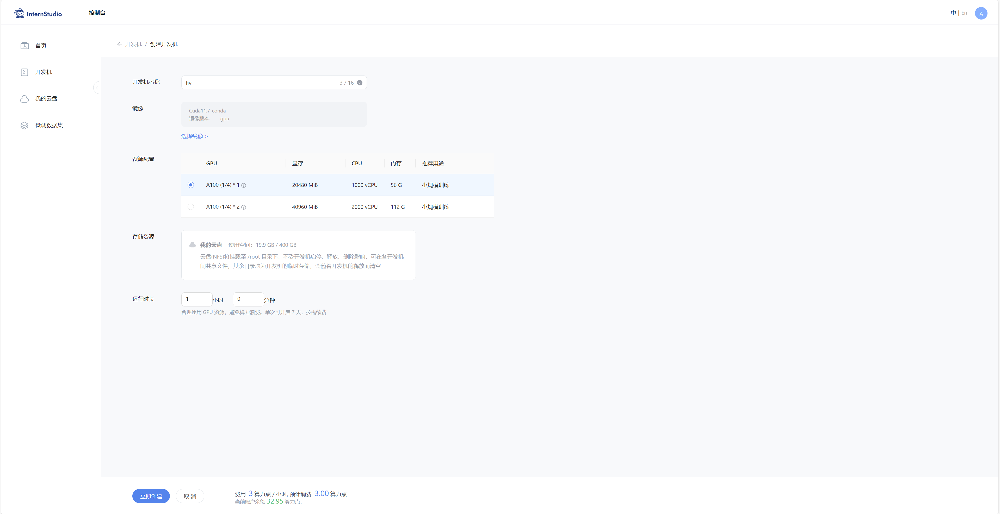

2. ### SSH连接

   在pycham中进行ssh连接

   先上传公钥到InterStudio

   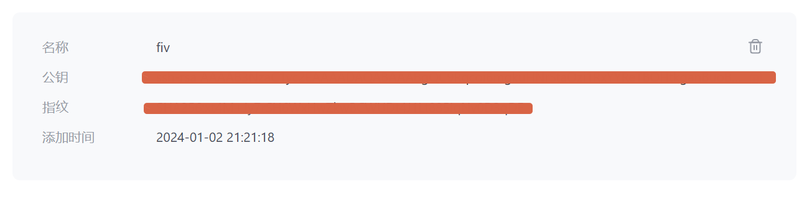

   在Pycharm中选择密钥对连接即可

   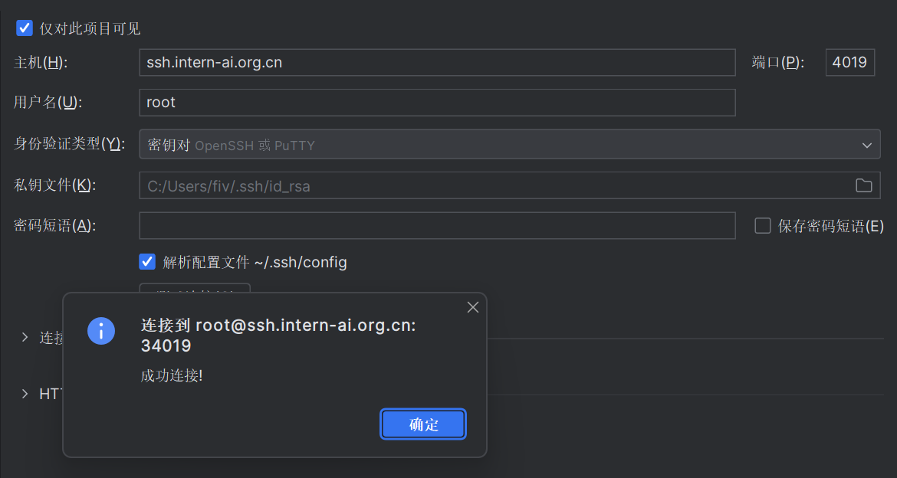

3. ### 配置环境

   - 查看conda环境

     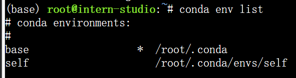

   - 利用conda来clone一个环境

     这里的share就是首页看到的云盘

     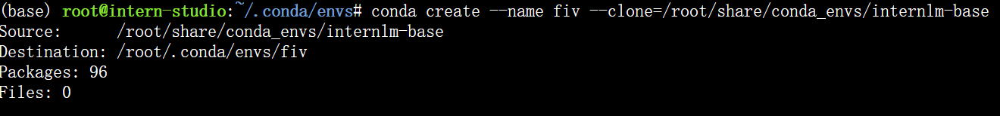

     再查看env

     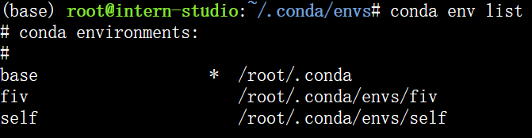

     激活fiv环境安装所需的依赖

     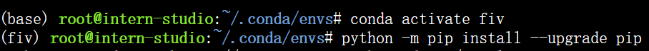

     复制模型

     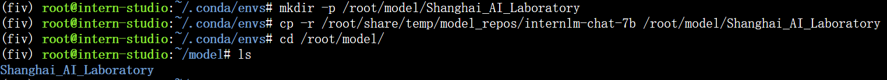

4. ### 代码部分

   clone代码

   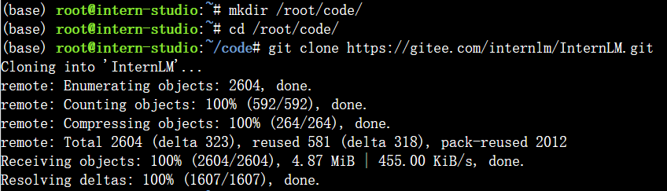

   编辑代码

   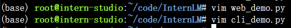

   加载预处理模型，提供promt模板

   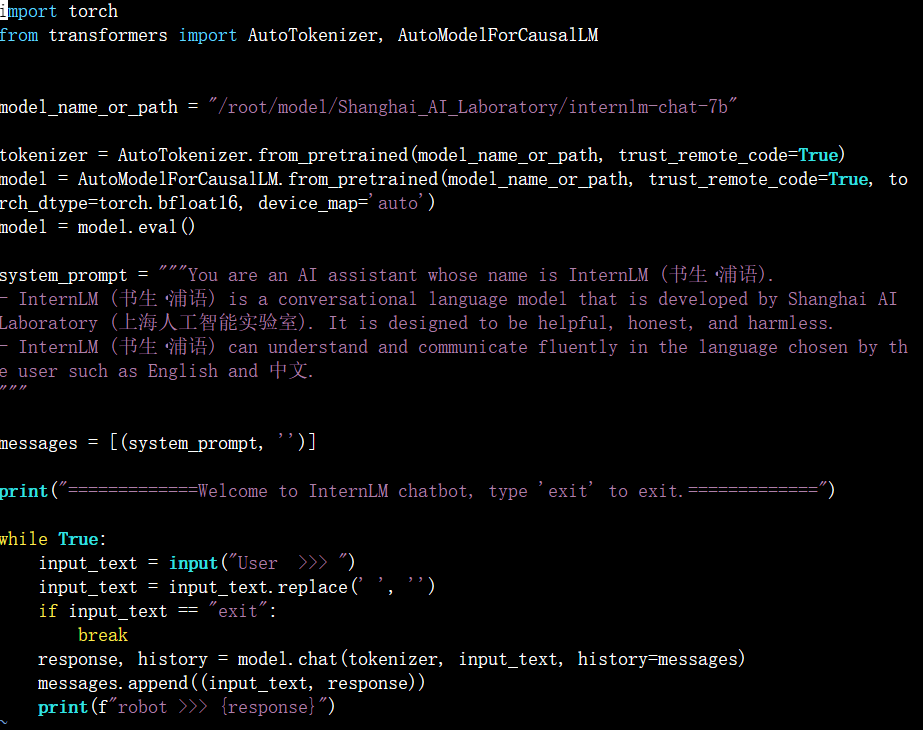

   问它问题
   
   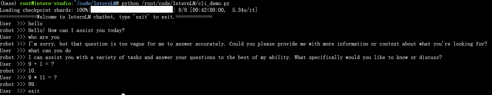

