# InternLM WORK

- [300 字的小故事](#300-字的小故事)

- [Hugging face 下载](#Hugging-face-下载)
- [浦语·灵笔部署](#浦语灵笔部署)
- [Lagent使用](#Lagent使用)


##  300 字的小故事

使用 InternLM-Chat-7B 模型生成 300 字的小故事

这个作业可以直接使用教程中的代码:

```python
import torch
from transformers import AutoTokenizer, AutoModelForCausalLM


model_name_or_path = "/root/model/Shanghai_AI_Laboratory/internlm-chat-7b"

tokenizer = AutoTokenizer.from_pretrained(model_name_or_path, trust_remote_code=True)
model = AutoModelForCausalLM.from_pretrained(model_name_or_path, trust_remote_code=True, torch_dtype=torch.bfloat16, device_map='auto')
model = model.eval()

system_prompt = """You are an AI assistant whose name is InternLM (书生·浦语).
- InternLM (书生·浦语) is a conversational language model that is developed by Shanghai AI Laboratory (上海人工智能实验室). It is designed to be helpful, honest, and harmless.
- InternLM (书生·浦语) can understand and communicate fluently in the language chosen by the user such as English and 中文.
"""

messages = [(system_prompt, '')]

print("=============Welcome to InternLM chatbot, type 'exit' to exit.=============")

while True:
    input_text = input("User  >>> ")
    input_text = input_text.replace(' ', '')
    if input_text == "exit":
        break
    response, history = model.chat(tokenizer, input_text, history=messages)
    messages.append((input_text, response))
    print(f"robot >>> {response}")

```


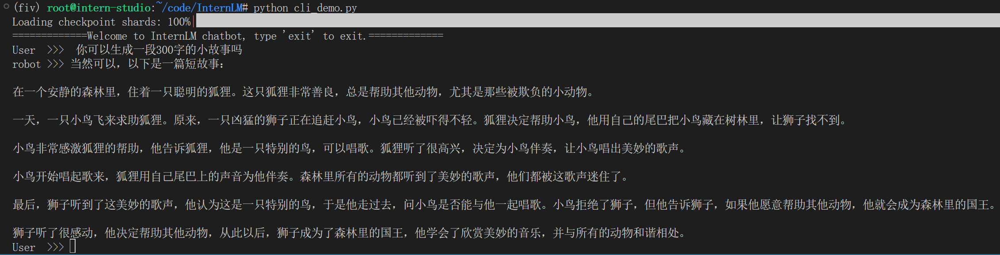

这里做个小小的实验，如果把`system_prompt`换成对应的promt会出什么效果呢

```python
system_prompt = """You are a Fairy-tales author. Your task is to write a fairy-tales stories in a vivid and intriguing language."""
```

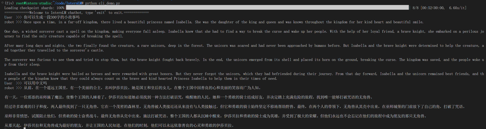

robot这里直接给了段英文小故事，风格和上面也有所不同


## Hugging face 下载

熟悉 hugging face 下载功能，使用 `huggingface_hub` python 包，下载 `InternLM-20B` 的 config.json 文件到本地


直接使用下载会产生以下错误：

```
requests.exceptions.ProxyError: (MaxRetryError("HTTPSConnectionPool(host='huggingface.co', port=443): Max retries exceeded with url: /internlm/internlm-7b/resolve/main/config.json (Caused by ProxyError('Cannot connect to proxy.', TimeoutError('timed out')))"), '(Request ID: bf763041-1f85-4570-9844-3a1911faffb2)')
```

改用镜像站下载：

```python
HF_ENDPOINT=https://hf-mirror.com python download.py
```

结果如下：

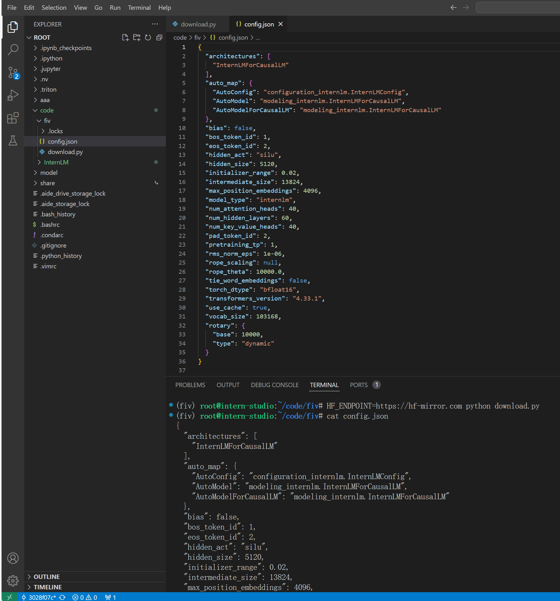


**download.py**

```python
import os 
from huggingface_hub import hf_hub_download

hf_hub_download(repo_id="internlm/internlm-20b", filename="config.json", local_dir="."
```

## 浦语·灵笔部署

完成浦语·灵笔的图文理解及创作部署

1. 先安装依赖

```python
pip install transformers==4.33.1 timm==0.4.12 sentencepiece==0.1.99 gradio==3.44.4 markdown2==2.4.10 xlsxwriter==3.1.2 einops accelerate
```

2. clone代码

```python
git clone https://gitee.com/internlm/InternLM-XComposer.git
```

3. 查看代码结构

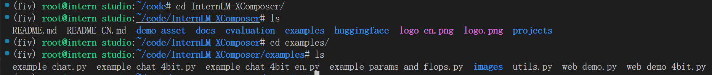

4. examples中有一个web_demo.py，查看文件得到输入参数

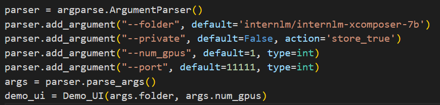

5. 在examples目录下输入命令

```python
python web_demo.py  --folder /root/model/Shanghai_AI_Laboratory/internlm-xcomposer-7b --num_gpus 1
```

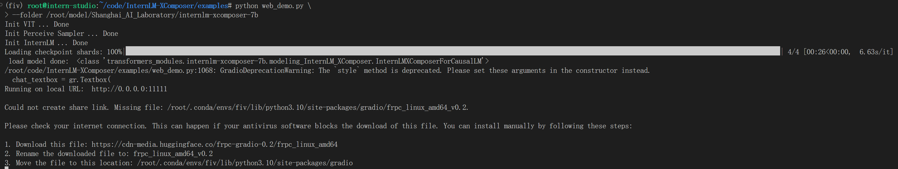

这里需要升级配置，用一张A100可能出现`oom`问题：

```python
torch.cuda.OutOfMemoryError: CUDA out of memory. Tried to allocate 20.00 MiB (GPU 0; 19.99 GiB total capacity; 19.11 GiB already allocated; 16.00 MiB free; 19.42 GiB reserved in total by PyTorch) If reserved memory is >> allocated memory try setting max_split_size_mb to avoid fragmentation.  See documentation for Memory Management and PYTORCH_CUDA_ALLOC_CONF
```

6. 启动之后在本机利用ssh将端口映射到本机

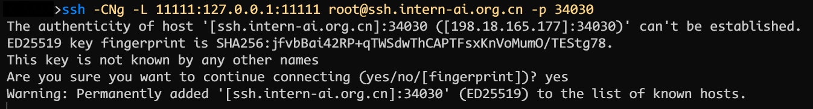

7. 在本机浏览器查看

   - 生成文章时下载图片

   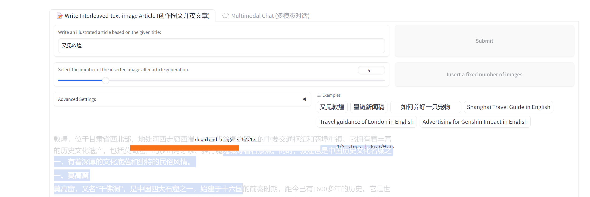

   - 完成文章

   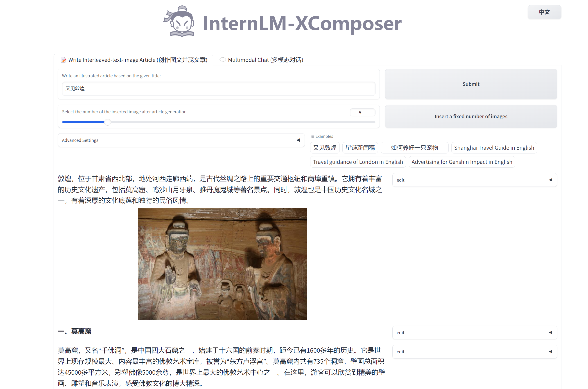

   - 试了一下多模态对话，感觉效果还有待提高

   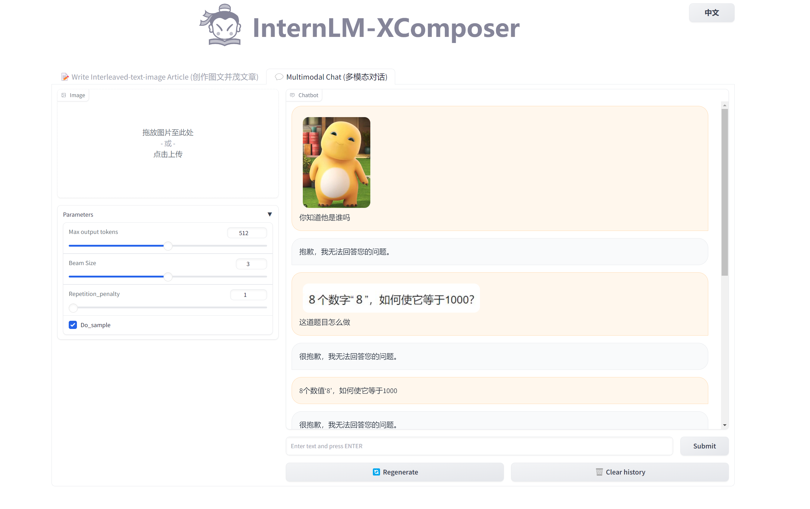

## Lagent使用

完成 Lagent 工具调用 Demo 创作部署

1. 安装`lagent`

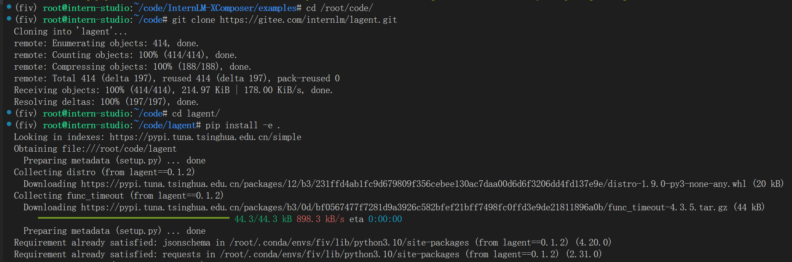

2. 修改代码后运行

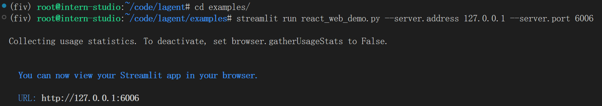

3. 在本机使用

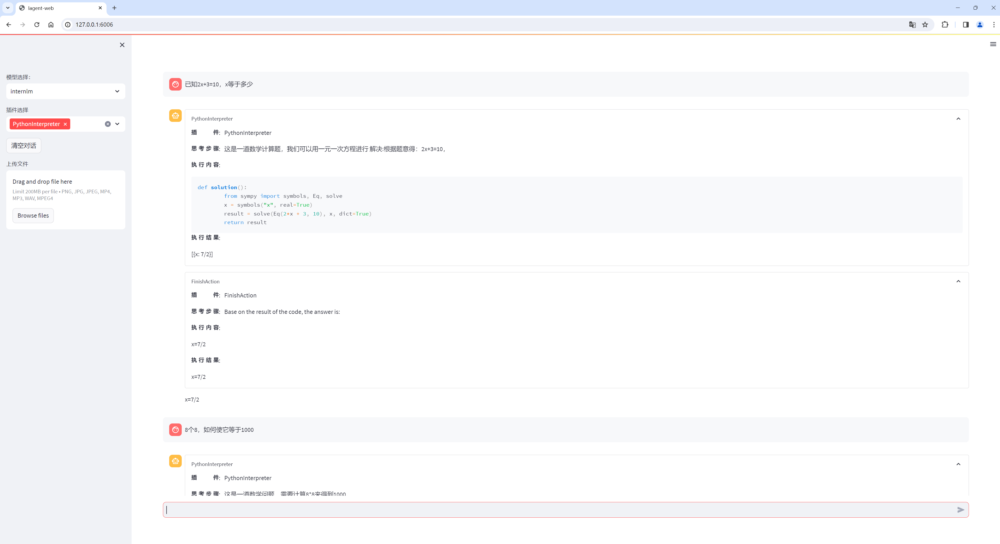

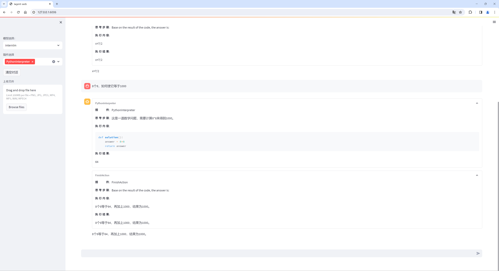

