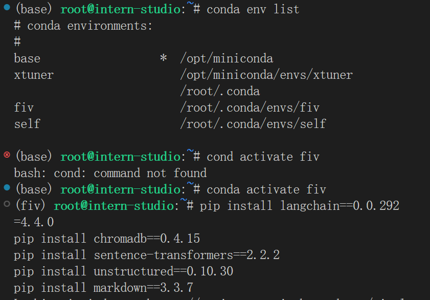
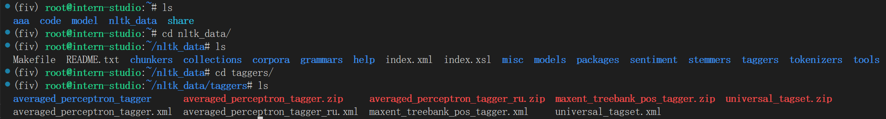
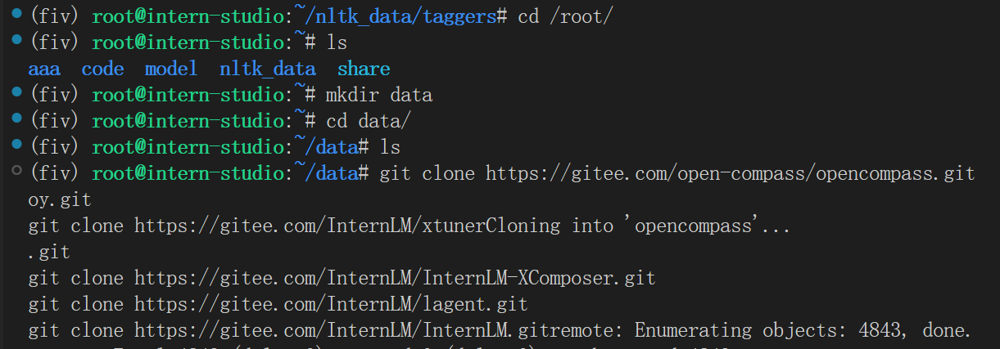
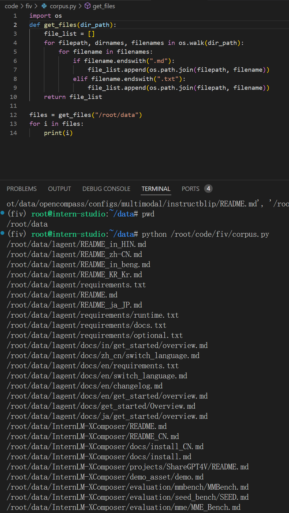
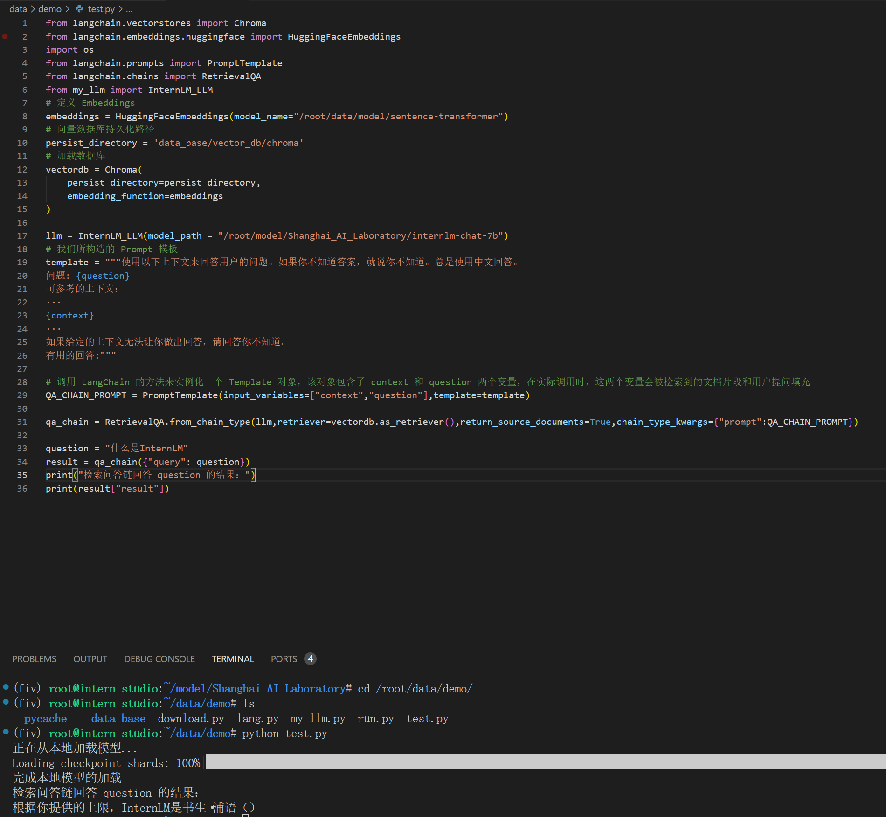
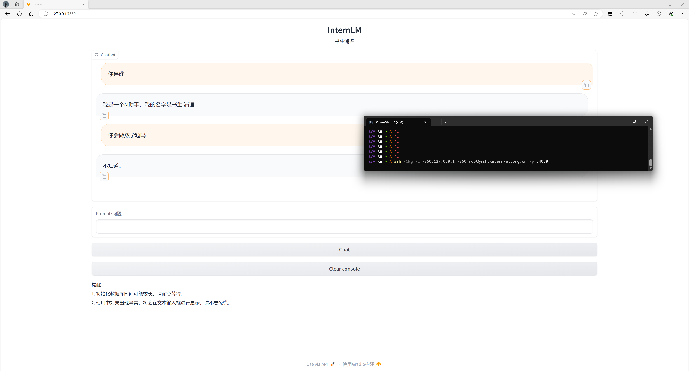

# InternLM & LangChain

### 复现教程

**1 环境配置**

- InternLM 模型使用之前的环境即可
- LangChain 相关环境配置



- 下载 NLTK 相关资源

  控制台输入以下命令下载`nltk`:

  ```bash
  cd /root
  git clone https://gitee.com/yzy0612/nltk_data.git  --branch gh-pages
  cd nltk_data
  mv packages/*  ./
  cd tokenizers
  unzip punkt.zip
  cd ../taggers
  unzip averaged_perceptron_tagger.zip
  ```

  查看结果:

  

- 下载教程代码

  ```bash
  cd /root/data
  git clone https://github.com/InternLM/tutorial
  ```

**2 知识库搭建**

- 数据库下载

```bash
cd /root/data
git clone https://gitee.com/open-compass/opencompass.git
git clone https://gitee.com/InternLM/lmdeploy.git
git clone https://gitee.com/InternLM/xtuner.git
git clone https://gitee.com/InternLM/InternLM-XComposer.git
git clone https://gitee.com/InternLM/lagent.git
git clone https://gitee.com/InternLM/InternLM.git
```



- 选用上述仓库中所有的 markdown、txt 文件作为示例语料库

  使用`.py`来获取文件路径:

  ```python
  import os 
  def get_files(dir_path):
      file_list = []
      for filepath, dirnames, filenames in os.walk(dir_path):
          for filename in filenames:
              if filename.endswith(".md"):
                  file_list.append(os.path.join(filepath, filename))
              elif filename.endswith(".txt"):
                  file_list.append(os.path.join(filepath, filename))
      return file_list
  ```

  `print`结果看看:

  

- 加载数据

  使用 `LangChain` 提供的 `FileLoader` 对象来加载目标文件，得到由目标文件解析出的纯文本内容

  在上面代码后面加上下面代码:

  ```python
  from tqdm import tqdm
  from langchain.document_loaders import UnstructuredFileLoader
  from langchain.document_loaders import UnstructuredMarkdownLoader
  
  def get_text(dir_path):
      file_lst = get_files(dir_path)
      docs = []
      for one_file in tqdm(file_lst):
          file_type = one_file.split('.')[-1]
          if file_type == 'md':
              loader = UnstructuredMarkdownLoader(one_file)
          elif file_type == 'txt':
              loader = UnstructuredFileLoader(one_file)
          else:
              continue
          docs.extend(loader.load())
      return docs
  ```

- 构建向量数据库

  使用`LangChain`来分割字符串:

  ```python
    from langchain.text_splitter import RecursiveCharacterTextSplitter
    
    text_splitter = RecursiveCharacterTextSplitter(
        chunk_size=500, chunk_overlap=150)
    split_docs = text_splitter.split_documents(docs)
  ```

    对`Sentence Transformer`进行文本向量化:

  ```python
    from langchain.embeddings.huggingface import HuggingFaceEmbeddings
    
    embeddings = HuggingFaceEmbeddings(model_name="/root/data/model/sentence-transformer")
  ```

    选择 Chroma 作为向量数据库:

  ```python
    from langchain.vectorstores import Chroma
    
    # 定义持久化路径
    persist_directory = 'data_base/vector_db/chroma'
    # 加载数据库
    vectordb = Chroma.from_documents(
        documents=split_docs,
        embedding=embeddings,
        persist_directory=persist_directory  # 允许我们将persist_directory目录保存到磁盘上
    )
    # 将加载的向量数据库持久化到磁盘上
    vectordb.persist()
  ```

    整合上面代码搭建知识库

**3 InternLM 接入 LangChain**

- 从 LangChain.llms.base.LLM 类继承一个子类，并重写构造函数与 `_call` 函数

  ```python
  from langchain.llms.base import LLM
  from typing import Any, List, Optional
  from langchain.callbacks.manager import CallbackManagerForLLMRun
  from transformers import AutoTokenizer, AutoModelForCausalLM
  import torch
  
  class InternLM_LLM(LLM):
      # 基于本地 InternLM 自定义 LLM 类
      tokenizer : AutoTokenizer = None
      model: AutoModelForCausalLM = None
  
      def __init__(self, model_path :str):
          # model_path: InternLM 模型路径
          # 从本地初始化模型
          super().__init__()
          print("正在从本地加载模型...")
          self.tokenizer = AutoTokenizer.from_pretrained(model_path, trust_remote_code=True)
          self.model = AutoModelForCausalLM.from_pretrained(model_path, trust_remote_code=True).to(torch.bfloat16).cuda()
          self.model = self.model.eval()
          print("完成本地模型的加载")
  
      def _call(self, prompt : str, stop: Optional[List[str]] = None,
                  run_manager: Optional[CallbackManagerForLLMRun] = None,
                  **kwargs: Any):
          # 重写调用函数
          system_prompt = """You are an AI assistant whose name is InternLM (书生·浦语).
          - InternLM (书生·浦语) is a conversational language model that is developed by Shanghai AI Laboratory (上海人工智能实验室). It is designed to be helpful, honest, and harmless.
          - InternLM (书生·浦语) can understand and communicate fluently in the language chosen by the user such as English and 中文.
          """
          
          messages = [(system_prompt, '')]
          response, history = self.model.chat(self.tokenizer, prompt , history=messages)
          return response
          
      @property
      def _llm_type(self) -> str:
          return "InternLM"
  ```


  

**4 构建检索问答链**

- 加载向量数据库
- 实例化自定义 LLM 与 Prompt Template
- 构建检索问答链
- 代码实现如下

```python
from langchain.vectorstores import Chroma
from langchain.embeddings.huggingface import HuggingFaceEmbeddings
import os
from langchain.prompts import PromptTemplate
from langchain.chains import RetrievalQA
from my_llm import InternLM_LLM
# 定义 Embeddings
embeddings = HuggingFaceEmbeddings(model_name="/root/data/model/sentence-transformer")
# 向量数据库持久化路径
persist_directory = 'data_base/vector_db/chroma'
# 加载数据库
vectordb = Chroma(
    persist_directory=persist_directory, 
    embedding_function=embeddings
)

llm = InternLM_LLM(model_path = "/root/model/Shanghai_AI_Laboratory/internlm-chat-7b")
# 我们所构造的 Prompt 模板
template = """使用以下上下文来回答用户的问题。如果你不知道答案，就说你不知道。总是使用中文回答。
问题: {question}
可参考的上下文：
···
{context}
···
如果给定的上下文无法让你做出回答，请回答你不知道。
有用的回答:"""

# 调用 LangChain 的方法来实例化一个 Template 对象，该对象包含了 context 和 question 两个变量，在实际调用时，这两个变量会被检索到的文档片段和用户提问填充
QA_CHAIN_PROMPT = PromptTemplate(input_variables=["context","question"],template=template)

qa_chain = RetrievalQA.from_chain_type(llm,retriever=vectordb.as_retriever(),return_source_documents=True,chain_type_kwargs={"prompt":QA_CHAIN_PROMPT})

question = "什么是InternLM"
result = qa_chain({"query": question})
print("检索问答链回答 question 的结果：")
print(result["result"])
```

- 结果如下:



**5 部署 Web Demo**

- 代码

```python

from langchain.vectorstores import Chroma
from langchain.embeddings.huggingface import HuggingFaceEmbeddings
import os
from my_llm import InternLM_LLM
from langchain.prompts import PromptTemplate
from langchain.chains import RetrievalQA
import gradio as gr

def load_chain():
    # 加载问答链
    # 定义 Embeddings
    embeddings = HuggingFaceEmbeddings(model_name="/root/data/model/sentence-transformer")

    # 向量数据库持久化路径
    persist_directory = 'data_base/vector_db/chroma'

    # 加载数据库
    vectordb = Chroma(
        persist_directory=persist_directory,  # 允许我们将persist_directory目录保存到磁盘上
        embedding_function=embeddings
    )

    # 加载自定义 LLM
    llm = InternLM_LLM(model_path = "/root/model/Shanghai_AI_Laboratory/internlm-chat-7b")

    # 定义一个 Prompt Template
    template = """使用以下上下文来回答最后的问题。如果你不知道答案，就说你不知道，不要试图编造答
    案。尽量使答案简明扼要。总是在回答的最后说“谢谢你的提问！”。
    {context}
    问题: {question}
    有用的回答:"""

    QA_CHAIN_PROMPT = PromptTemplate(input_variables=["context","question"],template=template)

    # 运行 chain
    qa_chain = RetrievalQA.from_chain_type(llm,retriever=vectordb.as_retriever(),return_source_documents=True,chain_type_kwargs={"prompt":QA_CHAIN_PROMPT})
    
    return qa_chain

class Model_center():
    """
    存储检索问答链的对象 
    """
    def __init__(self):
        # 构造函数，加载检索问答链
        self.chain = load_chain()

    def qa_chain_self_answer(self, question: str, chat_history: list = []):
        """
        调用问答链进行回答
        """
        if question == None or len(question) < 1:
            return "", chat_history
        try:
            chat_history.append(
                (question, self.chain({"query": question})["result"]))
            # 将问答结果直接附加到问答历史中，Gradio 会将其展示出来
            return "", chat_history
        except Exception as e:
            return e, chat_history


# 实例化核心功能对象
model_center = Model_center()
# 创建一个 Web 界面
block = gr.Blocks()
with block as demo:
    with gr.Row(equal_height=True):   
        with gr.Column(scale=15):
            # 展示的页面标题
            gr.Markdown("""<h1><center>InternLM</center></h1>
                <center>书生浦语</center>
                """)

    with gr.Row():
        with gr.Column(scale=4):
            # 创建一个聊天机器人对象
            chatbot = gr.Chatbot(height=450, show_copy_button=True)
            # 创建一个文本框组件，用于输入 prompt。
            msg = gr.Textbox(label="Prompt/问题")

            with gr.Row():
                # 创建提交按钮。
                db_wo_his_btn = gr.Button("Chat")
            with gr.Row():
                # 创建一个清除按钮，用于清除聊天机器人组件的内容。
                clear = gr.ClearButton(
                    components=[chatbot], value="Clear console")
                
        # 设置按钮的点击事件。当点击时，调用上面定义的 qa_chain_self_answer 函数，并传入用户的消息和聊天历史记录，然后更新文本框和聊天机器人组件。
        db_wo_his_btn.click(model_center.qa_chain_self_answer, inputs=[
                            msg, chatbot], outputs=[msg, chatbot])

    gr.Markdown("""提醒：<br>
    1. 初始化数据库时间可能较长，请耐心等待。
    2. 使用中如果出现异常，将会在文本输入框进行展示，请不要惊慌。 <br>
    """)
gr.close_all()
# 直接启动
demo.launch()
```

- 运行以上代码，并映射到本地浏览器



