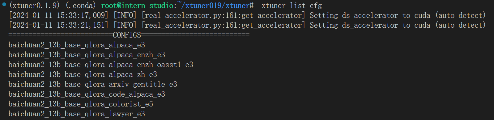

# XTuner

- [课程笔记](#课程笔记)
- [`XTuner`实战](#`XTuner`实战)

### 课程笔记


### `XTuner`实战

**1 配置环境**

- conda环境

  ```bash
  cd /root/share
  ./install_conda_env_internlm_base.sh xtuner0.1.9
  ```

  

- 数据集准备

  ```bash
  mkdir ~/ft-oasst1 && cd ~/ft-oasst1
  ```

**2 微调**

- 准备配置文件

  

  前面两条`log`好像时`deepspeed`的log

  ```bash
  cd ~/ft-oasst1
  xtuner copy-cfg internlm_chat_7b_qlora_oasst1_e3 .
  ```

- 模型下载

  ```bash
  cp -r /root/share/temp/model_repos/internlm-chat-7b ~/ft-oasst1/
  ```

- 数据集下载

  ```bash
  cd ~/ft-oasst1
  cp -r /root/share/temp/datasets/openassistant-guanaco .
  ```

- 复制配置文件

  ```bash
  cd ~/ft-oasst1
  xtuner copy-cfg internlm_chat_7b_qlora_oasst1_e3 .
  ```

- 修改配置文件

  ```bash
  cd ~/ft-oasst1
  vim internlm_chat_7b_qlora_oasst1_e3_copy.py
  ```

- 微调训练

  ```bash
  xtuner train ./internlm_chat_7b_qlora_oasst1_e3_copy.py --deepspeed deepspeed_zero2
  ```

- 转换为`HF`模型

  ```bash
  mkdir hf
  export MKL_SERVICE_FORCE_INTEL=1
  
  xtuner convert pth_to_hf ./internlm_chat_7b_qlora_oasst1_e3_copy.py ./work_dirs/internlm_chat_7b_qlora_oasst1_e3_copy/epoch_1.pth ./hf
  ```

- 将 `HuggingFace adapter` 合并到大语言模型

  ```bash
  xtuner convert merge ./internlm-chat-7b ./hf ./merged --max-shard-size 2GB
  ```

- 与合并后的模型对话

  ```bash
  xtuner chat ./merged --prompt-template internlm_chat
  ```

- 运行

  ```bash
  python ./cli_demo.py
  ```

  


