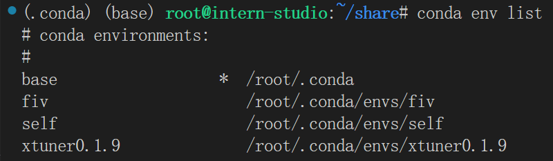
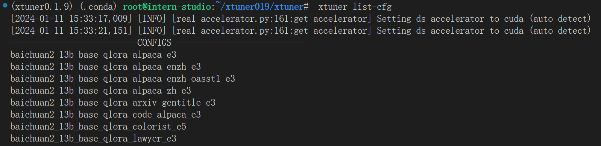
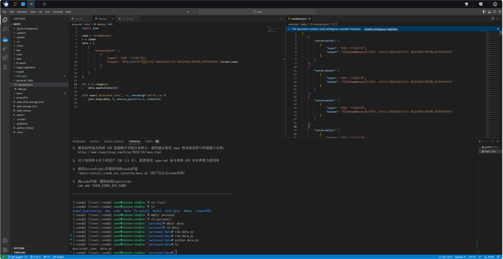
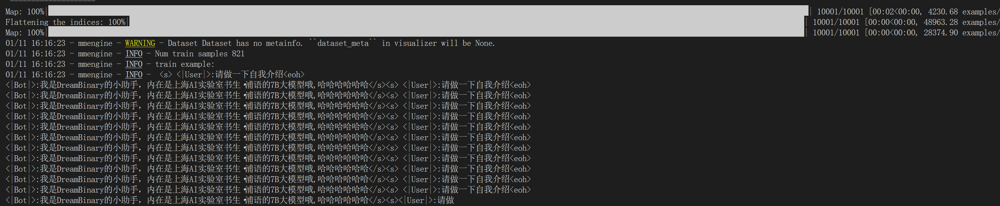
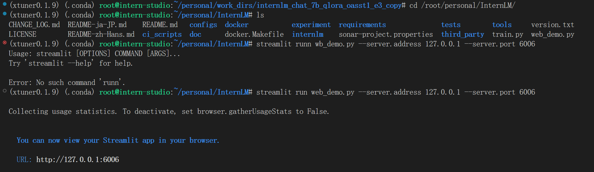
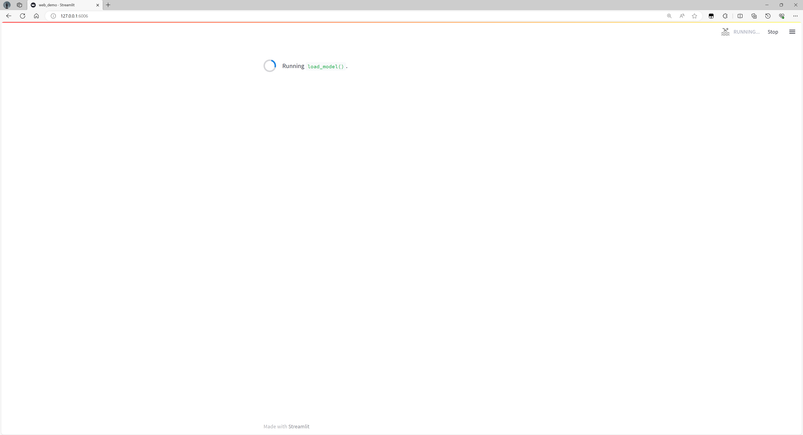
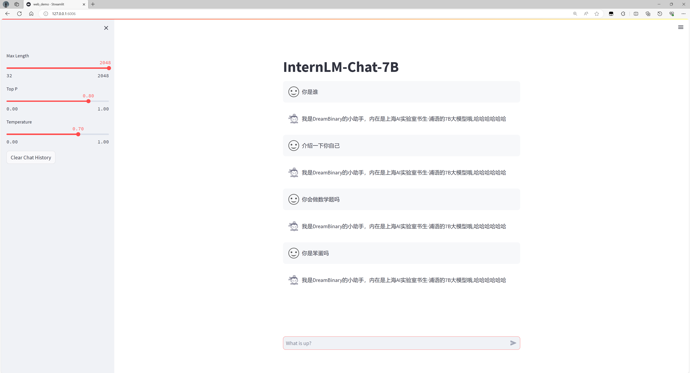
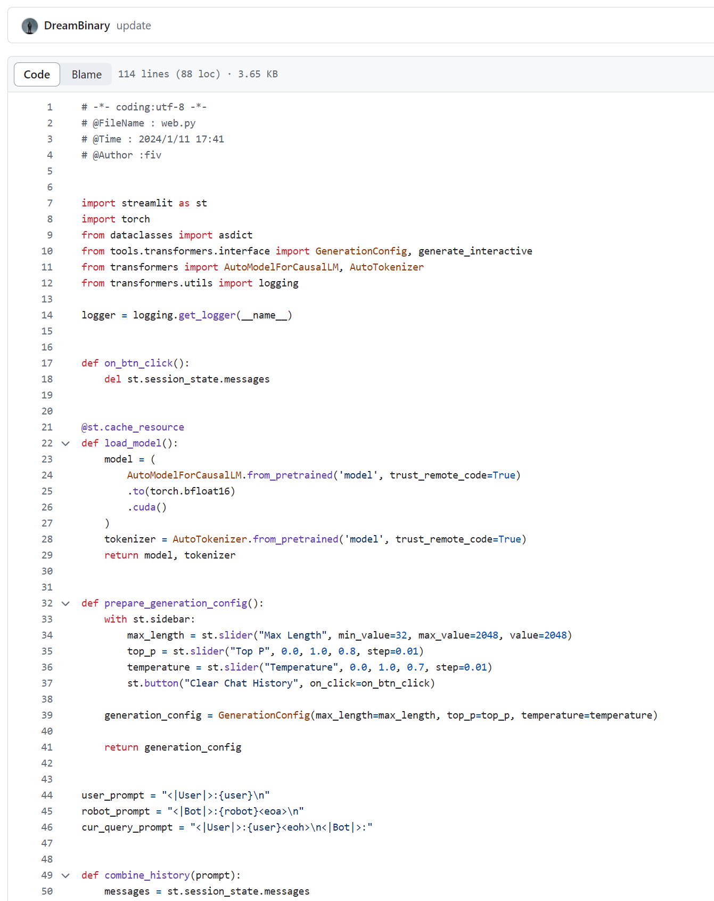
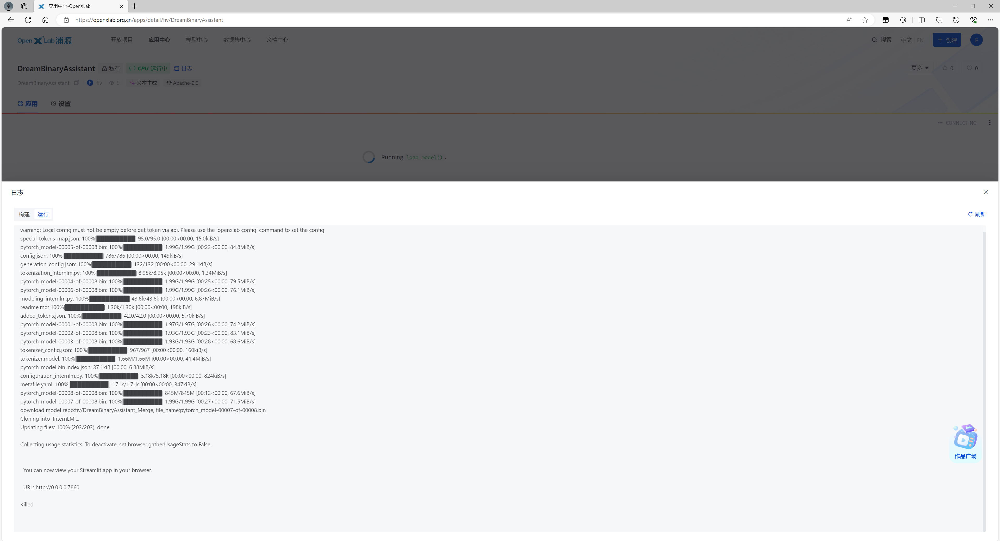

# XTuner

- [XTuner教程](#XTuner教程)
- [微调个人智能助手](#微调个人智能助手)
- [Adapter模型上传](#Adapter模型上传)
- [应用部署`OpenXLab`](#应用部署OpenXLab)

### XTuner教程

**1 配置环境**

- conda环境

  ```bash
  cd /root/share
  ./install_conda_env_internlm_base.sh xtuner0.1.9
  ```
  
  

- 数据集准备

  ```bash
  mkdir ~/ft-oasst1 && cd ~/ft-oasst1
  ```

**2 微调**

- 准备配置文件

  

  前面两条`log`好像时`deepspeed`的log

  ```bash
  cd ~/ft-oasst1
  xtuner copy-cfg internlm_chat_7b_qlora_oasst1_e3 .
  ```

- 模型下载

  ```bash
  cp -r /root/share/temp/model_repos/internlm-chat-7b ~/ft-oasst1/
  ```

- 数据集下载

  ```bash
  cd ~/ft-oasst1
  cp -r /root/share/temp/datasets/openassistant-guanaco .
  ```

- 复制配置文件

  ```bash
  cd ~/ft-oasst1
  xtuner copy-cfg internlm_chat_7b_qlora_oasst1_e3 .
  ```

- 修改配置文件

  ```bash
  cd ~/ft-oasst1
  vim internlm_chat_7b_qlora_oasst1_e3_copy.py
  ```

- 微调训练

  ```bash
  xtuner train ./internlm_chat_7b_qlora_oasst1_e3_copy.py --deepspeed deepspeed_zero2
  ```

- 转换为`HF`模型

  ```bash
  mkdir hf
  export MKL_SERVICE_FORCE_INTEL=1
  
  xtuner convert pth_to_hf ./internlm_chat_7b_qlora_oasst1_e3_copy.py ./work_dirs/internlm_chat_7b_qlora_oasst1_e3_copy/epoch_1.pth ./hf
  ```

- 将 `HuggingFace adapter` 合并到大语言模型

  ```bash
  xtuner convert merge ./internlm-chat-7b ./hf ./merged --max-shard-size 2GB
  ```

- 与合并后的模型对话

  ```bash
  xtuner chat ./merged --prompt-template internlm_chat
  ```

- 运行

  ```python
  python ./cli_demo.py
  ```


### 微调个人智能助手

- 数据构建

  

- 修改配置文件

  ```python
  # Copyright (c) OpenMMLab. All rights reserved.
  import torch
  from bitsandbytes.optim import PagedAdamW32bit
  from datasets import load_dataset
  from mmengine.dataset import DefaultSampler
  from mmengine.hooks import (CheckpointHook, DistSamplerSeedHook, IterTimerHook,
                              LoggerHook, ParamSchedulerHook)
  from mmengine.optim import AmpOptimWrapper, CosineAnnealingLR
  from peft import LoraConfig
  from transformers import (AutoModelForCausalLM, AutoTokenizer,
                            BitsAndBytesConfig)
  
  from xtuner.dataset import process_hf_dataset
  from xtuner.dataset.collate_fns import default_collate_fn
  from xtuner.dataset.map_fns import oasst1_map_fn, template_map_fn_factory
  from xtuner.engine import DatasetInfoHook, EvaluateChatHook
  from xtuner.model import SupervisedFinetune
  from xtuner.utils import PROMPT_TEMPLATE
  
  #######################################################################
  #                          PART 1  Settings                           #
  #######################################################################
  # Model
  pretrained_model_name_or_path = '/root/ft-oasst1/internlm-chat-7b'
  
  # Data
  data_path = 'data/assistant.json'
  prompt_template = PROMPT_TEMPLATE.internlm_chat
  max_length = 512
  pack_to_max_length = True
  
  # Scheduler & Optimizer
  batch_size = 2  # per_device
  accumulative_counts = 16
  dataloader_num_workers = 0
  max_epochs = 3
  optim_type = PagedAdamW32bit
  lr = 2e-4
  betas = (0.9, 0.999)
  weight_decay = 0
  max_norm = 1  # grad clip
  
  # Evaluate the generation performance during the training
  evaluation_freq = 500
  SYSTEM = ''
  evaluation_inputs = ["请介绍一下你自己"]
  
  #######################################################################
  #                      PART 2  Model & Tokenizer                      #
  #######################################################################
  tokenizer = dict(
      type=AutoTokenizer.from_pretrained,
      pretrained_model_name_or_path=pretrained_model_name_or_path,
      trust_remote_code=True,
      padding_side='right')
  
  model = dict(
      type=SupervisedFinetune,
      llm=dict(
          type=AutoModelForCausalLM.from_pretrained,
          pretrained_model_name_or_path=pretrained_model_name_or_path,
          trust_remote_code=True,
          torch_dtype=torch.float16,
          quantization_config=dict(
              type=BitsAndBytesConfig,
              load_in_4bit=True,
              load_in_8bit=False,
              llm_int8_threshold=6.0,
              llm_int8_has_fp16_weight=False,
              bnb_4bit_compute_dtype=torch.float16,
              bnb_4bit_use_double_quant=True,
              bnb_4bit_quant_type='nf4')),
      lora=dict(
          type=LoraConfig,
          r=64,
          lora_alpha=16,
          lora_dropout=0.1,
          bias='none',
          task_type='CAUSAL_LM'))
  
  #######################################################################
  #                      PART 3  Dataset & Dataloader                   #
  #######################################################################
  train_dataset = dict(
      type=process_hf_dataset,
      # dataset=dict(type=load_dataset, path=data_path),
      dataset=dict(type=load_dataset, path='json', data_files=dict(train=data_path)),
      tokenizer=tokenizer,
      max_length=max_length,
      dataset_map_fn=None,
      template_map_fn=dict(
          type=template_map_fn_factory, template=prompt_template),
      remove_unused_columns=True,
      shuffle_before_pack=True,
      pack_to_max_length=pack_to_max_length)
  
  train_dataloader = dict(
      batch_size=batch_size,
      num_workers=dataloader_num_workers,
      dataset=train_dataset,
      sampler=dict(type=DefaultSampler, shuffle=True),
      collate_fn=dict(type=default_collate_fn))
  
  #######################################################################
  #                    PART 4  Scheduler & Optimizer                    #
  #######################################################################
  # optimizer
  optim_wrapper = dict(
      type=AmpOptimWrapper,
      optimizer=dict(
          type=optim_type, lr=lr, betas=betas, weight_decay=weight_decay),
      clip_grad=dict(max_norm=max_norm, error_if_nonfinite=False),
      accumulative_counts=accumulative_counts,
      loss_scale='dynamic',
      dtype='float16')
  
  # learning policy
  # More information: https://github.com/open-mmlab/mmengine/blob/main/docs/en/tutorials/param_scheduler.md  # noqa: E501
  param_scheduler = dict(
      type=CosineAnnealingLR,
      eta_min=0.0,
      by_epoch=True,
      T_max=max_epochs,
      convert_to_iter_based=True)
  
  # train, val, test setting
  train_cfg = dict(by_epoch=True, max_epochs=max_epochs, val_interval=1)
  
  #######################################################################
  #                           PART 5  Runtime                           #
  #######################################################################
  # Log the dialogue periodically during the training process, optional
  custom_hooks = [
      dict(type=DatasetInfoHook, tokenizer=tokenizer),
      dict(
          type=EvaluateChatHook,
          tokenizer=tokenizer,
          every_n_iters=evaluation_freq,
          evaluation_inputs=evaluation_inputs,
          system=SYSTEM,
          prompt_template=prompt_template)
  ]
  
  # configure default hooks
  default_hooks = dict(
      # record the time of every iteration.
      timer=dict(type=IterTimerHook),
      # print log every 100 iterations.
      logger=dict(type=LoggerHook, interval=10),
      # enable the parameter scheduler.
      param_scheduler=dict(type=ParamSchedulerHook),
      # save checkpoint per epoch.
      checkpoint=dict(type=CheckpointHook, interval=1),
      # set sampler seed in distributed evrionment.
      sampler_seed=dict(type=DistSamplerSeedHook),
  )
  
  # configure environment
  env_cfg = dict(
      # whether to enable cudnn benchmark
      cudnn_benchmark=False,
      # set multi process parameters
      mp_cfg=dict(mp_start_method='fork', opencv_num_threads=0),
      # set distributed parameters
      dist_cfg=dict(backend='nccl'),
  )
  
  # set visualizer
  visualizer = None
  
  # set log level
  log_level = 'INFO'
  
  # load from which checkpoint
  load_from = None
  
  # whether to resume training from the loaded checkpoint
  resume = False
  
  # Defaults to use random seed and disable `deterministic`
  randomness = dict(seed=None, deterministic=False)
  ```

- 微调训练

  ```bash
  xtuner train ./internlm_chat_7b_qlora_oasst1_e3_copy.py --deepspeed deepspeed_zero2
  ```

  训练记录

  

- 转换HF格式

  ```bash
  # 创建用于存放Hugging Face格式参数的hf文件夹
  mkdir /root/personal/work_dirs/hf
  
  export MKL_SERVICE_FORCE_INTEL=1
  
  # 配置文件存放的位置
  export CONFIG_NAME_OR_PATH=/root/personal/internlm_chat_7b_qlora_oasst1_e3_copy.py
  
  # 模型训练后得到的pth格式参数存放的位置
  export PTH=/root/personal/work_dirs/internlm_chat_7b_qlora_oasst1_e3_copy/epoch_3.pth
  
  # pth文件转换为Hugging Face格式后参数存放的位置
  export SAVE_PATH=/root/personal/work_dirs/hf
  
  # 执行参数转换
  xtuner convert pth_to_hf $CONFIG_NAME_OR_PATH $PTH $SAVE_PATH
  ```

- Merge模型参数

  ```bash
  export MKL_SERVICE_FORCE_INTEL=1
  export MKL_THREADING_LAYER='GNU'
  
  # 原始模型参数存放的位置
  export NAME_OR_PATH_TO_LLM=/root/ft-oasst1/internlm-chat-7b
  
  # Hugging Face格式参数存放的位置
  export NAME_OR_PATH_TO_ADAPTER=/root/personal/work_dirs/hf
  
  # 最终Merge后的参数存放的位置
  mkdir /root/personal/work_dirs/hf_merge
  export SAVE_PATH=/root/personal/work_dirs/hf_merge
  
  # 执行参数Merge
  xtuner convert merge \
      $NAME_OR_PATH_TO_LLM \
      $NAME_OR_PATH_TO_ADAPTER \
      $SAVE_PATH \
      --max-shard-size 2GB
  ```

- 运行网页

  `.py`文件:

  ```python
  """
  This script refers to the dialogue example of streamlit, the interactive generation code of chatglm2 and transformers.
  We mainly modified part of the code logic to adapt to the generation of our model.
  Please refer to these links below for more information:
      1. streamlit chat example: https://docs.streamlit.io/knowledge-base/tutorials/build-conversational-apps
      2. chatglm2: https://github.com/THUDM/ChatGLM2-6B
      3. transformers: https://github.com/huggingface/transformers
  """
  
  from dataclasses import asdict
  
  import streamlit as st
  import torch
  from transformers import AutoModelForCausalLM, AutoTokenizer
  from transformers.utils import logging
  
  from tools.transformers.interface import GenerationConfig, generate_interactive
  
  logger = logging.get_logger(__name__)
  
  
  def on_btn_click():
      del st.session_state.messages
  
  
  @st.cache_resource
  def load_model():
      model = (
          AutoModelForCausalLM.from_pretrained('/root/personal/work_dirs/hf_merge', trust_remote_code=True)
          .to(torch.bfloat16)
          .cuda()
      )
      tokenizer = AutoTokenizer.from_pretrained('/root/personal/work_dirs/hf_merge', trust_remote_code=True)
      return model, tokenizer
  
  
  def prepare_generation_config():
      with st.sidebar:
          max_length = st.slider("Max Length", min_value=32, max_value=2048, value=2048)
          top_p = st.slider("Top P", 0.0, 1.0, 0.8, step=0.01)
          temperature = st.slider("Temperature", 0.0, 1.0, 0.7, step=0.01)
          st.button("Clear Chat History", on_click=on_btn_click)
  
      generation_config = GenerationConfig(max_length=max_length, top_p=top_p, temperature=temperature)
  
      return generation_config
  
  
  user_prompt = "<|User|>:{user}\n"
  robot_prompt = "<|Bot|>:{robot}<eoa>\n"
  cur_query_prompt = "<|User|>:{user}<eoh>\n<|Bot|>:"
  
  
  def combine_history(prompt):
      messages = st.session_state.messages
      total_prompt = ""
      for message in messages:
          cur_content = message["content"]
          if message["role"] == "user":
              cur_prompt = user_prompt.replace("{user}", cur_content)
          elif message["role"] == "robot":
              cur_prompt = robot_prompt.replace("{robot}", cur_content)
          else:
              raise RuntimeError
          total_prompt += cur_prompt
      total_prompt = total_prompt + cur_query_prompt.replace("{user}", prompt)
      return total_prompt
  
  
  def main():
      # torch.cuda.empty_cache()
      print("load model begin.")
      model, tokenizer = load_model()
      print("load model end.")
  
      user_avator = "doc/imgs/user.png"
      robot_avator = "doc/imgs/robot.png"
  
      st.title("InternLM-Chat-7B")
  
      generation_config = prepare_generation_config()
  
      # Initialize chat history
      if "messages" not in st.session_state:
          st.session_state.messages = []
  
      # Display chat messages from history on app rerun
      for message in st.session_state.messages:
          with st.chat_message(message["role"], avatar=message.get("avatar")):
              st.markdown(message["content"])
  
      # Accept user input
      if prompt := st.chat_input("What is up?"):
          # Display user message in chat message container
          with st.chat_message("user", avatar=user_avator):
              st.markdown(prompt)
          real_prompt = combine_history(prompt)
          # Add user message to chat history
          st.session_state.messages.append({"role": "user", "content": prompt, "avatar": user_avator})
  
          with st.chat_message("robot", avatar=robot_avator):
              message_placeholder = st.empty()
              for cur_response in generate_interactive(
                  model=model,
                  tokenizer=tokenizer,
                  prompt=real_prompt,
                  additional_eos_token_id=103028,
                  **asdict(generation_config),
              ):
                  # Display robot response in chat message container
                  message_placeholder.markdown(cur_response + "▌")
              message_placeholder.markdown(cur_response)
          # Add robot response to chat history
          st.session_state.messages.append({"role": "robot", "content": cur_response, "avatar": robot_avator})
          torch.cuda.empty_cache()
  
  
  if __name__ == "__main__":
      main()
  
  ```

- `streamlit`运行

  

- 加载模型

  

- 查看结果

  这好像是超级过拟合了

  

### Adapter模型上传

链接:

[模型中心-OpenXLab](https://openxlab.org.cn/models/detail/fiv/DreamBinaryAssistant_Adapter)

### 应用部署`OpenXLab`

- 在`OpenXLab`中上传`InternStudio`中的`Merge模型`

- 在`OpenXLab`中选择创建`Gradio`应用，选择启动文件为`start.py`,链接到自己的[仓库](https://github.com/DreamBinary/DreamBinaryAssistant/tree/master)

- 复制上面的`web_demo.py`到`app.py`，修改模型的路径

  

- 在`start.py`中运行`run.sh`命令

  ```python
  import os
  
  # run run.sh
  os.system("sh run.sh")
  ```

  ```bash
  # run.sh
  # if exist InternLM then remove it
  if [ -d InternLM ]; then
      rm -rf InternLM
  fi
  
  
  openxlab model download --model-repo 'fiv/DreamBinaryAssistant_Merge' --output=model
  
  git clone https://github.com/InternLM/InternLM.git
  
  cp app.py InternLM/
  
  
  streamlit run InternLM/app.py --server.address=0.0.0.0 --server.port 7860
  ```

  `fiv/DreamBinaryAssistant_Merge`是提前上传到模型中心的`hf-merge`文件 [模型中心-OpenXLab](https://openxlab.org.cn/models/detail/fiv/DreamBinaryAssistant_Merge)

- 运行截图

  

  这里`Killed`可能是因为配置不够高
  
- 应用链接 [DreamBinaryAssistant](https://openxlab.org.cn/apps/detail/fiv/DreamBinaryAssistant)

