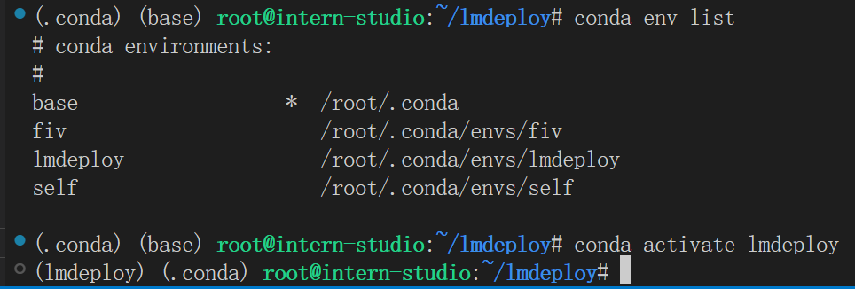
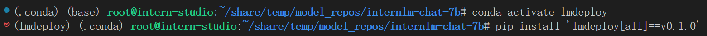
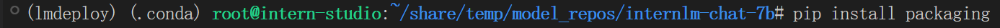
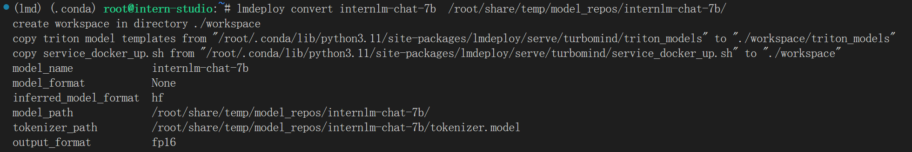
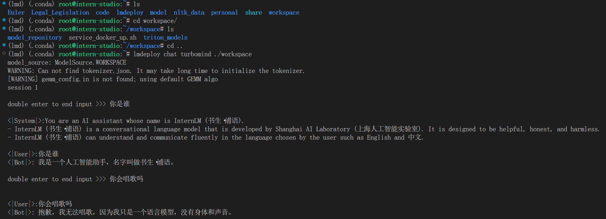
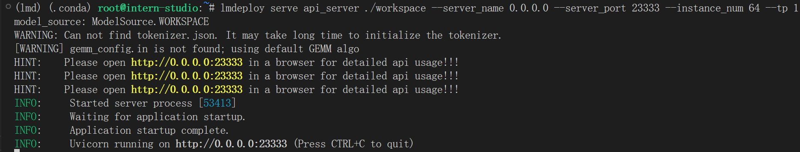
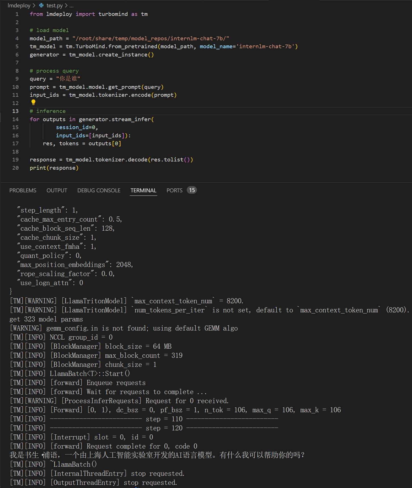

# LMDeploy


**1 环境配置**

创建`conda`环境:

```bash
/root/share/install_conda_env_internlm_base.sh lmdeploy
conda activate lmdeploy
pip install 'lmdeploy[all]==v0.1.0'
pip install packaging
```







**2 模型转换**

```bash
lmdeploy convert internlm-chat-7b  /root/share/temp/model_repos/internlm-chat-7b/
```



**3 TurboMind+命令行**

```bash
lmdeploy chat turbomind ./workspace
```



**4 TurboMind+API**

```bash
lmdeploy serve api_server ./workspace \
	--server_name 0.0.0.0 \
	--server_port 23333 \
	--instance_num 64 \
	--tp 1
```



**5 TurboMind+Gradio**

```bash
lmdeploy serve gradio http://0.0.0.0:23333 \
	--server_name 0.0.0.0 \
	--server_port 6006 \
	--restful_api True
```

```bash
lmdeploy serve gradio ./workspace
```

**6 TurboMind+Python**

```python
from lmdeploy import turbomind as tm

# load model
model_path = "/root/share/temp/model_repos/internlm-chat-7b/"
tm_model = tm.TurboMind.from_pretrained(model_path, model_name='internlm-chat-7b')
generator = tm_model.create_instance()

# process query
query = "你是谁"
prompt = tm_model.model.get_prompt(query)
input_ids = tm_model.tokenizer.encode(prompt)

# inference
for outputs in generator.stream_infer(
        session_id=0,
        input_ids=[input_ids]):
    res, tokens = outputs[0]

response = tm_model.tokenizer.decode(res.tolist())
print(response)
```

