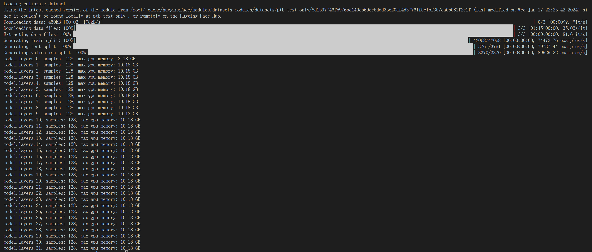

# LMDeploy

- [300 字小故事](#TurboMind+Python-生成-300-字小故事)

- [Internlm-chat-7b KV Cache 量化](#Internlm-chat-7b-KV-Cache-量化)

### TurboMind+Python 生成 300 字小故事

```python
from lmdeploy import turbomind as tm

# load model
model_path = "/root/share/temp/model_repos/internlm-chat-7b/"
tm_model = tm.TurboMind.from_pretrained(model_path, model_name='internlm-chat-7b')
generator = tm_model.create_instance()

# process query
query = " 写一段 300 字的小故事"
prompt = tm_model.model.get_prompt(query)
input_ids = tm_model.tokenizer.encode(prompt)

# inference
for outputs in generator.stream_infer(
        session_id=0,
        input_ids=[input_ids]):
    res, tokens = outputs[0]

response = tm_model.tokenizer.decode(res.tolist())
print(response)
```


### Internlm-chat-7b KV Cache 量化

- **转成 turbomind**

  ```bash
  lmdeploy convert internlm-chat-7b /share/temp/model_repos/internlm-chat-7b
  ```
  
- **计算 minmax**

  ```bash
  # 更换镜像站
  export HF_ENDPOINT=https://hf-mirror.com
  # 计算 minmax
  lmdeploy lite calibrate  \
  	--model  /root/share/temp/model_repos/internlm-chat-7b/  \
      --calib_dataset "ptb" \
      --calib_samples 128 \
      --calib_seqlen 2048 \
    --work_dir ./quant_output
  
```
  
  选择 128 条输入样本，每条样本长度为 2048，数据集选择 ptb
  
  
  
- 通过 minmax 获取量化参数

  ```bash
  # 通过 minmax 获取量化参数
  mkdir workspace/triton_models/weights
  lmdeploy lite kv_qparams \
    --work_dir ./quant_output  \
    --turbomind_dir workspace/triton_models/weights/ \
    --kv_sym False \
    --num_tp 1
  ```

  

- 修改`config.ini`配置

  