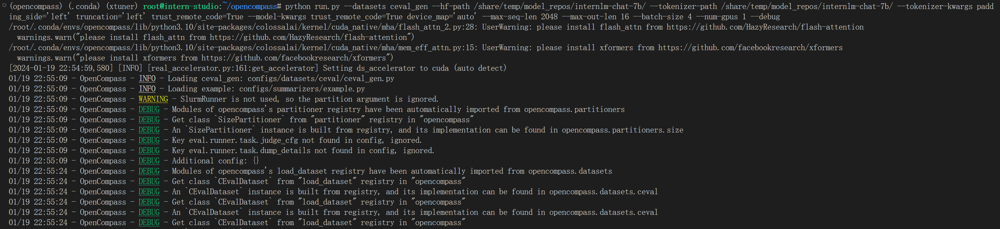

# OpenCompass 

### 安装

```bash
conda create --name opencompass --clone=/root/share/conda_envs/internlm-base
source activate opencompass
git clone https://github.com/open-compass/opencompass
cd opencompass
pip install -e .
```

### 数据集

```bash
cp /share/temp/datasets/OpenCompassData-core-20231110.zip /root/opencompass/
unzip OpenCompassData-core-20231110.zip
```

### 启动测评

在`OpenCompass`目录中执行命令

```bash
python run.py \
--datasets ceval_gen \
--hf-path /share/temp/model_repos/internlm-chat-7b/ \  # HuggingFace 模型路径
--tokenizer-path /share/temp/model_repos/internlm-chat-7b/ \  # HuggingFace tokenizer 路径（如果与模型路径相同，可以省略）
--tokenizer-kwargs padding_side='left' truncation='left' trust_remote_code=True \  # 构建 tokenizer 的参数
--model-kwargs device_map='auto' trust_remote_code=True \  # 构建模型的参数
--max-seq-len 2048 \  # 模型可以接受的最大序列长度
--max-out-len 16 \  # 生成的最大 token 数
--batch-size 4  \  # 批量大小
--num-gpus 1  # 运行模型所需的 GPU 数量
--debug
```




```bash
20240119_225509
tabulate format
^^^^^^^^^^^^^^^^^^^^^^^^^^^^^^^^^^^^^^^^^^^^^^^^^^^^^^^^^^^^^^^^^^^^^^^^^^^^^^^^^^^^^^^^^^^^^^^^^^^^^^^^^^^^^^^^^^^^^^^^^^^^^^^^
dataset                                         version    metric         mode      opencompass.models.huggingface.HuggingFace_model_repos_internlm-chat-7b
----------------------------------------------  ---------  -------------  ------  -------------------------------------------------------------------------
ceval-computer_network                          db9ce2     accuracy       gen                                                                         31.58
ceval-operating_system                          1c2571     accuracy       gen                                                                         36.84
ceval-computer_architecture                     a74dad     accuracy       gen                                                                         28.57
ceval-college_programming                       4ca32a     accuracy       gen                                                                         32.43
ceval-college_physics                           963fa8     accuracy       gen                                                                         26.32
ceval-college_chemistry                         e78857     accuracy       gen                                                                         16.67
ceval-advanced_mathematics                      ce03e2     accuracy       gen                                                                         21.05
ceval-probability_and_statistics                65e812     accuracy       gen                                                                         38.89
ceval-discrete_mathematics                      e894ae     accuracy       gen                                                                         18.75
ceval-electrical_engineer                       ae42b9     accuracy       gen                                                                         35.14
ceval-metrology_engineer                        ee34ea     accuracy       gen                                                                         50
ceval-high_school_mathematics                   1dc5bf     accuracy       gen                                                                         22.22
ceval-high_school_physics                       adf25f     accuracy       gen                                                                         31.58
ceval-high_school_chemistry                     2ed27f     accuracy       gen                                                                         15.79
ceval-high_school_biology                       8e2b9a     accuracy       gen                                                                         36.84
ceval-middle_school_mathematics                 bee8d5     accuracy       gen                                                                         26.32
ceval-middle_school_biology                     86817c     accuracy       gen                                                                         61.9
ceval-middle_school_physics                     8accf6     accuracy       gen                                                                         63.16
ceval-middle_school_chemistry                   167a15     accuracy       gen                                                                         60
ceval-veterinary_medicine                       b4e08d     accuracy       gen                                                                         47.83
ceval-college_economics                         f3f4e6     accuracy       gen                                                                         41.82
ceval-business_administration                   c1614e     accuracy       gen                                                                         33.33
ceval-marxism                                   cf874c     accuracy       gen                                                                         68.42
ceval-mao_zedong_thought                        51c7a4     accuracy       gen                                                                         70.83
ceval-education_science                         591fee     accuracy       gen                                                                         58.62
ceval-teacher_qualification                     4e4ced     accuracy       gen                                                                         70.45
ceval-high_school_politics                      5c0de2     accuracy       gen                                                                         26.32
ceval-high_school_geography                     865461     accuracy       gen                                                                         47.37
ceval-middle_school_politics                    5be3e7     accuracy       gen                                                                         52.38
ceval-middle_school_geography                   8a63be     accuracy       gen                                                                         58.33
ceval-modern_chinese_history                    fc01af     accuracy       gen                                                                         73.91
ceval-ideological_and_moral_cultivation         a2aa4a     accuracy       gen                                                                         63.16
ceval-logic                                     f5b022     accuracy       gen                                                                         31.82
ceval-law                                       a110a1     accuracy       gen                                                                         25
ceval-chinese_language_and_literature           0f8b68     accuracy       gen                                                                         30.43
ceval-art_studies                               2a1300     accuracy       gen                                                                         60.61
ceval-professional_tour_guide                   4e673e     accuracy       gen                                                                         62.07
ceval-legal_professional                        ce8787     accuracy       gen                                                                         39.13
ceval-high_school_chinese                       315705     accuracy       gen                                                                         63.16
ceval-high_school_history                       7eb30a     accuracy       gen                                                                         70
ceval-middle_school_history                     48ab4a     accuracy       gen                                                                         59.09
ceval-civil_servant                             87d061     accuracy       gen                                                                         53.19
ceval-sports_science                            70f27b     accuracy       gen                                                                         52.63
ceval-plant_protection                          8941f9     accuracy       gen                                                                         59.09
ceval-basic_medicine                            c409d6     accuracy       gen                                                                         47.37
ceval-clinical_medicine                         49e82d     accuracy       gen                                                                         40.91
ceval-urban_and_rural_planner                   95b885     accuracy       gen                                                                         45.65
ceval-accountant                                002837     accuracy       gen                                                                         26.53
ceval-fire_engineer                             bc23f5     accuracy       gen                                                                         22.58
ceval-environmental_impact_assessment_engineer  c64e2d     accuracy       gen                                                                         64.52
ceval-tax_accountant                            3a5e3c     accuracy       gen                                                                         34.69
ceval-physician                                 6e277d     accuracy       gen                                                                         40.82
ceval-stem                                      -          naive_average  gen                                                                         35.09
ceval-social-science                            -          naive_average  gen                                                                         52.79
ceval-humanities                                -          naive_average  gen                                                                         52.58
ceval-other                                     -          naive_average  gen                                                                         44.36
ceval-hard                                      -          naive_average  gen                                                                         23.91
ceval                                           -          naive_average  gen                                                                         44.16
$$$$$$$$$$$$$$$$$$$$$$$$$$$$$$$$$$$$$$$$$$$$$$$$$$$$$$$$$$$$$$$$$$$$$$$$$$$$$$$$$$$$$$$$$$$$$$$$$$$$$$$$$$$$$$$$$$$$$$$$$$$$$$$$

-------------------------------------------------------------------------------------------------------------------------------- THIS IS A DIVIDER --------------------------------------------------------------------------------------------------------------------------------

csv format
^^^^^^^^^^^^^^^^^^^^^^^^^^^^^^^^^^^^^^^^^^^^^^^^^^^^^^^^^^^^^^^^^^^^^^^^^^^^^^^^^^^^^^^^^^^^^^^^^^^^^^^^^^^^^^^^^^^^^^^^^^^^^^^^
dataset,version,metric,mode,opencompass.models.huggingface.HuggingFace_model_repos_internlm-chat-7b
ceval-computer_network,db9ce2,accuracy,gen,31.58
ceval-operating_system,1c2571,accuracy,gen,36.84
ceval-computer_architecture,a74dad,accuracy,gen,28.57
ceval-college_programming,4ca32a,accuracy,gen,32.43
ceval-college_physics,963fa8,accuracy,gen,26.32
ceval-college_chemistry,e78857,accuracy,gen,16.67
ceval-advanced_mathematics,ce03e2,accuracy,gen,21.05
ceval-probability_and_statistics,65e812,accuracy,gen,38.89
ceval-discrete_mathematics,e894ae,accuracy,gen,18.75
ceval-electrical_engineer,ae42b9,accuracy,gen,35.14
ceval-metrology_engineer,ee34ea,accuracy,gen,50.00
ceval-high_school_mathematics,1dc5bf,accuracy,gen,22.22
ceval-high_school_physics,adf25f,accuracy,gen,31.58
ceval-high_school_chemistry,2ed27f,accuracy,gen,15.79
ceval-high_school_biology,8e2b9a,accuracy,gen,36.84
ceval-middle_school_mathematics,bee8d5,accuracy,gen,26.32
ceval-middle_school_biology,86817c,accuracy,gen,61.90
ceval-middle_school_physics,8accf6,accuracy,gen,63.16
ceval-middle_school_chemistry,167a15,accuracy,gen,60.00
ceval-veterinary_medicine,b4e08d,accuracy,gen,47.83
ceval-college_economics,f3f4e6,accuracy,gen,41.82
ceval-business_administration,c1614e,accuracy,gen,33.33
ceval-marxism,cf874c,accuracy,gen,68.42
ceval-mao_zedong_thought,51c7a4,accuracy,gen,70.83
ceval-education_science,591fee,accuracy,gen,58.62
ceval-teacher_qualification,4e4ced,accuracy,gen,70.45
ceval-high_school_politics,5c0de2,accuracy,gen,26.32
ceval-high_school_geography,865461,accuracy,gen,47.37
ceval-middle_school_politics,5be3e7,accuracy,gen,52.38
ceval-middle_school_geography,8a63be,accuracy,gen,58.33
ceval-modern_chinese_history,fc01af,accuracy,gen,73.91
ceval-ideological_and_moral_cultivation,a2aa4a,accuracy,gen,63.16
ceval-logic,f5b022,accuracy,gen,31.82
ceval-law,a110a1,accuracy,gen,25.00
ceval-chinese_language_and_literature,0f8b68,accuracy,gen,30.43
ceval-art_studies,2a1300,accuracy,gen,60.61
ceval-professional_tour_guide,4e673e,accuracy,gen,62.07
ceval-legal_professional,ce8787,accuracy,gen,39.13
ceval-high_school_chinese,315705,accuracy,gen,63.16
ceval-high_school_history,7eb30a,accuracy,gen,70.00
ceval-middle_school_history,48ab4a,accuracy,gen,59.09
ceval-civil_servant,87d061,accuracy,gen,53.19
ceval-sports_science,70f27b,accuracy,gen,52.63
ceval-plant_protection,8941f9,accuracy,gen,59.09
ceval-basic_medicine,c409d6,accuracy,gen,47.37
ceval-clinical_medicine,49e82d,accuracy,gen,40.91
ceval-urban_and_rural_planner,95b885,accuracy,gen,45.65
ceval-accountant,002837,accuracy,gen,26.53
ceval-fire_engineer,bc23f5,accuracy,gen,22.58
ceval-environmental_impact_assessment_engineer,c64e2d,accuracy,gen,64.52
ceval-tax_accountant,3a5e3c,accuracy,gen,34.69
ceval-physician,6e277d,accuracy,gen,40.82
ceval-stem,-,naive_average,gen,35.09
ceval-social-science,-,naive_average,gen,52.79
ceval-humanities,-,naive_average,gen,52.58
ceval-other,-,naive_average,gen,44.36
ceval-hard,-,naive_average,gen,23.91
ceval,-,naive_average,gen,44.16
$$$$$$$$$$$$$$$$$$$$$$$$$$$$$$$$$$$$$$$$$$$$$$$$$$$$$$$$$$$$$$$$$$$$$$$$$$$$$$$$$$$$$$$$$$$$$$$$$$$$$$$$$$$$$$$$$$$$$$$$$$$$$$$$

-------------------------------------------------------------------------------------------------------------------------------- THIS IS A DIVIDER --------------------------------------------------------------------------------------------------------------------------------

raw format
^^^^^^^^^^^^^^^^^^^^^^^^^^^^^^^^^^^^^^^^^^^^^^^^^^^^^^^^^^^^^^^^^^^^^^^^^^^^^^^^^^^^^^^^^^^^^^^^^^^^^^^^^^^^^^^^^^^^^^^^^^^^^^^^
-------------------------------
Model: opencompass.models.huggingface.HuggingFace_model_repos_internlm-chat-7b
ceval-computer_network: {'accuracy': 31.57894736842105}
ceval-operating_system: {'accuracy': 36.84210526315789}
ceval-computer_architecture: {'accuracy': 28.57142857142857}
ceval-college_programming: {'accuracy': 32.432432432432435}
ceval-college_physics: {'accuracy': 26.31578947368421}
ceval-college_chemistry: {'accuracy': 16.666666666666664}
ceval-advanced_mathematics: {'accuracy': 21.052631578947366}
ceval-probability_and_statistics: {'accuracy': 38.88888888888889}
ceval-discrete_mathematics: {'accuracy': 18.75}
ceval-electrical_engineer: {'accuracy': 35.13513513513514}
ceval-metrology_engineer: {'accuracy': 50.0}
ceval-high_school_mathematics: {'accuracy': 22.22222222222222}
ceval-high_school_physics: {'accuracy': 31.57894736842105}
ceval-high_school_chemistry: {'accuracy': 15.789473684210526}
ceval-high_school_biology: {'accuracy': 36.84210526315789}
ceval-middle_school_mathematics: {'accuracy': 26.31578947368421}
ceval-middle_school_biology: {'accuracy': 61.904761904761905}
ceval-middle_school_physics: {'accuracy': 63.1578947368421}
ceval-middle_school_chemistry: {'accuracy': 60.0}
ceval-veterinary_medicine: {'accuracy': 47.82608695652174}
ceval-college_economics: {'accuracy': 41.81818181818181}
ceval-business_administration: {'accuracy': 33.33333333333333}
ceval-marxism: {'accuracy': 68.42105263157895}
ceval-mao_zedong_thought: {'accuracy': 70.83333333333334}
ceval-education_science: {'accuracy': 58.620689655172406}
ceval-teacher_qualification: {'accuracy': 70.45454545454545}
ceval-high_school_politics: {'accuracy': 26.31578947368421}
ceval-high_school_geography: {'accuracy': 47.368421052631575}
ceval-middle_school_politics: {'accuracy': 52.38095238095239}
ceval-middle_school_geography: {'accuracy': 58.333333333333336}
ceval-modern_chinese_history: {'accuracy': 73.91304347826086}
ceval-ideological_and_moral_cultivation: {'accuracy': 63.1578947368421}
ceval-logic: {'accuracy': 31.818181818181817}
ceval-law: {'accuracy': 25.0}
ceval-chinese_language_and_literature: {'accuracy': 30.434782608695656}
ceval-art_studies: {'accuracy': 60.60606060606061}
ceval-professional_tour_guide: {'accuracy': 62.06896551724138}
ceval-legal_professional: {'accuracy': 39.130434782608695}
ceval-high_school_chinese: {'accuracy': 63.1578947368421}
ceval-high_school_history: {'accuracy': 70.0}
ceval-middle_school_history: {'accuracy': 59.09090909090909}
ceval-civil_servant: {'accuracy': 53.191489361702125}
ceval-sports_science: {'accuracy': 52.63157894736842}
ceval-plant_protection: {'accuracy': 59.09090909090909}
ceval-basic_medicine: {'accuracy': 47.368421052631575}
ceval-clinical_medicine: {'accuracy': 40.909090909090914}
ceval-urban_and_rural_planner: {'accuracy': 45.65217391304348}
ceval-accountant: {'accuracy': 26.53061224489796}
ceval-fire_engineer: {'accuracy': 22.58064516129032}
ceval-environmental_impact_assessment_engineer: {'accuracy': 64.51612903225806}
ceval-tax_accountant: {'accuracy': 34.69387755102041}
ceval-physician: {'accuracy': 40.816326530612244}
ceval-stem: {'ceval-computer_network': 31.57894736842105, 'ceval-operating_system': 36.84210526315789, 'ceval-computer_architecture': 28.57142857142857, 'ceval-college_programming': 32.432432432432435, 'ceval-college_physics': 26.31578947368421, 'ceval-college_chemistry': 16.666666666666664, 'ceval-advanced_mathematics': 21.052631578947366, 'ceval-probability_and_statistics': 38.88888888888889, 'ceval-discrete_mathematics': 18.75, 'ceval-electrical_engineer': 35.13513513513514, 'ceval-metrology_engineer': 50.0, 'ceval-high_school_mathematics': 22.22222222222222, 'ceval-high_school_physics': 31.57894736842105, 'ceval-high_school_chemistry': 15.789473684210526, 'ceval-high_school_biology': 36.84210526315789, 'ceval-middle_school_mathematics': 26.31578947368421, 'ceval-middle_school_biology': 61.904761904761905, 'ceval-middle_school_physics': 63.1578947368421, 'ceval-middle_school_chemistry': 60.0, 'ceval-veterinary_medicine': 47.82608695652174, 'naive_average': 35.09356534942919}
ceval-social-science: {'ceval-college_economics': 41.81818181818181, 'ceval-business_administration': 33.33333333333333, 'ceval-marxism': 68.42105263157895, 'ceval-mao_zedong_thought': 70.83333333333334, 'ceval-education_science': 58.620689655172406, 'ceval-teacher_qualification': 70.45454545454545, 'ceval-high_school_politics': 26.31578947368421, 'ceval-high_school_geography': 47.368421052631575, 'ceval-middle_school_politics': 52.38095238095239, 'ceval-middle_school_geography': 58.333333333333336, 'naive_average': 52.78796324667468}
ceval-humanities: {'ceval-modern_chinese_history': 73.91304347826086, 'ceval-ideological_and_moral_cultivation': 63.1578947368421, 'ceval-logic': 31.818181818181817, 'ceval-law': 25.0, 'ceval-chinese_language_and_literature': 30.434782608695656, 'ceval-art_studies': 60.60606060606061, 'ceval-professional_tour_guide': 62.06896551724138, 'ceval-legal_professional': 39.130434782608695, 'ceval-high_school_chinese': 63.1578947368421, 'ceval-high_school_history': 70.0, 'ceval-middle_school_history': 59.09090909090909, 'naive_average': 52.57983339778566}
ceval-other: {'ceval-civil_servant': 53.191489361702125, 'ceval-sports_science': 52.63157894736842, 'ceval-plant_protection': 59.09090909090909, 'ceval-basic_medicine': 47.368421052631575, 'ceval-clinical_medicine': 40.909090909090914, 'ceval-urban_and_rural_planner': 45.65217391304348, 'ceval-accountant': 26.53061224489796, 'ceval-fire_engineer': 22.58064516129032, 'ceval-environmental_impact_assessment_engineer': 64.51612903225806, 'ceval-tax_accountant': 34.69387755102041, 'ceval-physician': 40.816326530612244, 'naive_average': 44.36193216316587}
ceval-hard: {'ceval-advanced_mathematics': 21.052631578947366, 'ceval-discrete_mathematics': 18.75, 'ceval-probability_and_statistics': 38.88888888888889, 'ceval-college_chemistry': 16.666666666666664, 'ceval-college_physics': 26.31578947368421, 'ceval-high_school_mathematics': 22.22222222222222, 'ceval-high_school_chemistry': 15.789473684210526, 'ceval-high_school_physics': 31.57894736842105, 'naive_average': 23.90807748538011}
ceval: {'ceval-computer_network': 31.57894736842105, 'ceval-operating_system': 36.84210526315789, 'ceval-computer_architecture': 28.57142857142857, 'ceval-college_programming': 32.432432432432435, 'ceval-college_physics': 26.31578947368421, 'ceval-college_chemistry': 16.666666666666664, 'ceval-advanced_mathematics': 21.052631578947366, 'ceval-probability_and_statistics': 38.88888888888889, 'ceval-discrete_mathematics': 18.75, 'ceval-electrical_engineer': 35.13513513513514, 'ceval-metrology_engineer': 50.0, 'ceval-high_school_mathematics': 22.22222222222222, 'ceval-high_school_physics': 31.57894736842105, 'ceval-high_school_chemistry': 15.789473684210526, 'ceval-high_school_biology': 36.84210526315789, 'ceval-middle_school_mathematics': 26.31578947368421, 'ceval-middle_school_biology': 61.904761904761905, 'ceval-middle_school_physics': 63.1578947368421, 'ceval-middle_school_chemistry': 60.0, 'ceval-veterinary_medicine': 47.82608695652174, 'ceval-college_economics': 41.81818181818181, 'ceval-business_administration': 33.33333333333333, 'ceval-marxism': 68.42105263157895, 'ceval-mao_zedong_thought': 70.83333333333334, 'ceval-education_science': 58.620689655172406, 'ceval-teacher_qualification': 70.45454545454545, 'ceval-high_school_politics': 26.31578947368421, 'ceval-high_school_geography': 47.368421052631575, 'ceval-middle_school_politics': 52.38095238095239, 'ceval-middle_school_geography': 58.333333333333336, 'ceval-modern_chinese_history': 73.91304347826086, 'ceval-ideological_and_moral_cultivation': 63.1578947368421, 'ceval-logic': 31.818181818181817, 'ceval-law': 25.0, 'ceval-chinese_language_and_literature': 30.434782608695656, 'ceval-art_studies': 60.60606060606061, 'ceval-professional_tour_guide': 62.06896551724138, 'ceval-legal_professional': 39.130434782608695, 'ceval-high_school_chinese': 63.1578947368421, 'ceval-high_school_history': 70.0, 'ceval-middle_school_history': 59.09090909090909, 'ceval-civil_servant': 53.191489361702125, 'ceval-sports_science': 52.63157894736842, 'ceval-plant_protection': 59.09090909090909, 'ceval-basic_medicine': 47.368421052631575, 'ceval-clinical_medicine': 40.909090909090914, 'ceval-urban_and_rural_planner': 45.65217391304348, 'ceval-accountant': 26.53061224489796, 'ceval-fire_engineer': 22.58064516129032, 'ceval-environmental_impact_assessment_engineer': 64.51612903225806, 'ceval-tax_accountant': 34.69387755102041, 'ceval-physician': 40.816326530612244, 'naive_average': 44.15596847357301}
$$$$$$$$$$$$$$$$$$$$$$$$$$$$$$$$$$$$$$$$$$$$$$$$$$$$$$$$$$$$$$$$$$$$$$$$$$$$$$$$$$$$$$$$$$$$$$$$$$$$$$$$$$$$$$$$$$$$$$$$$$$$$$$$

```